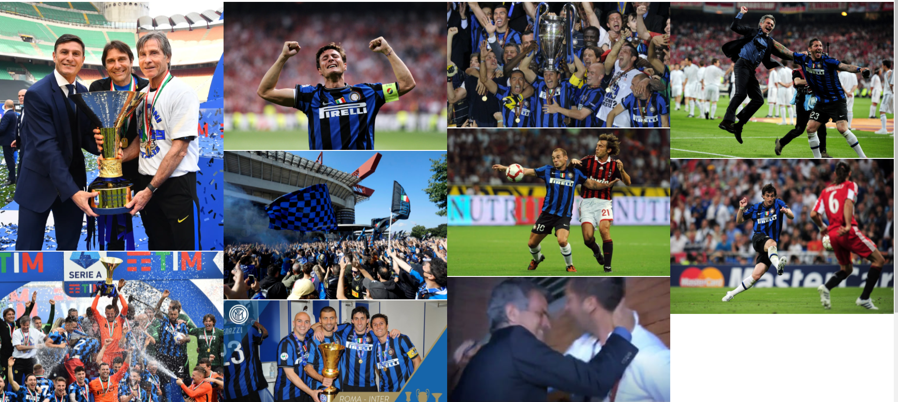

# The legends of Italian football
My idea with this project was to create something based on my own interest, and among them you'll find sports. Inter has always been an exciting team for me to follow, and as a possible new supporter of the club, it can be interesting to have a short but at the same time informative website.

This website is for new, but also loyal supporters of the club, to be able to stay up to date on the current situation, explore the club's progress and history, and be able to enjoy fantastic pictures from Inter's time.
Inter is a team from the legendary history, and this website helps the interested souls to get to know them better in one place.

## Features

- Navigation Bar

  - The navigation bar is featured on all three pages, the full responsive navigation bar includes links Home page, Gallery and History page and is identical in each page to allow for easy navigation.

   -  This section will allow the user to easily navigate from page to page across all devices without having to revert back to the previous page via the "back" button.

   
- The landing page image

   - This section introduces the user to Love Running with an eye catching animation to grab their attention

- The Footer 

   - The footer section includes links to the relevant social media sites for Inter Milan. The links will open to a new tab to allow easy navigation for the user.
   
   - The footer is valuable to the user as it encourages them to keep connected via social media.

- The Gallery Page

   - The gallery page will provide the user with images of different Inter players through the years.

* The History Page

   - This page is valuable to the user and to the website because if you want to learn more about the clubs epochs you can do it here.

### Future features

   - An idea i have is to have a live updating league table (If its possible)
   - A forum for football/Inter fans

## Testing

- I tested that this page works in different browsers: Opera, Chrome, Microsoft Edge.

- I confirmed that the the navigation, header, gallery and history page are all readable and easy to understand.

- I confirmed that this project is responsive. looks good and functions on all standard screen sizes using the devtools device toolbar.

### Validator test

<ul>
<li>Html </li>

No errors were returned when passing through the official W3C validator.

</ul>
<ul>
<li>CSS</li>

 No errors were returned when passing through the official (Jigsaw) validator

</ul>

 

## Deployment

- The site was deployed to GitHub pages. The steps to deploy are as follows: 
    
    - Log in to GitHub and locate the GitHub Repository
    
    - At the top of the Repository (not top of page), locate the "Settings" Button on the menu.

    - Scroll down the Settings page until you locate the "GitHub Pages" Section.

    - Under "Source", click the dropdown called "None" and select "Master Branch".

    - Once the master branch has been selected, the page will be automatically refreshed with a detailed ribbon display to indicate the successful deployment. 

The live link can be found here - https://ericolssoon.github.io/My-first-project/

## Credits

### Code

- The code to make the league table was taken from https://codepen.io/Shayley/pen/NWqrvqQ

### Content 

- The text in the history page are from:

   - [Wikipedia](https://en.wikipedia.org/wiki/Inter_Milan)

   - [SempreInter](https://sempreinter.com/)

- The icons in the footer were taken from [Font Awesome](https://fontawesome.com/)

### Media

- The photos used on the home page are from https://sempreinter.com

- The images used for the gallery page are from:

   - https://sportige.com
   - https://football-italia.net
   - https://www.reuters.com

### Acknowledgements

- Tutor support at Code Institute for their support.
